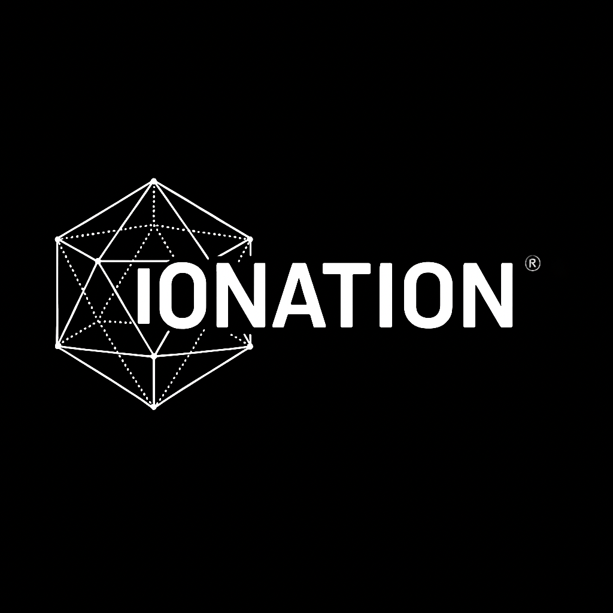
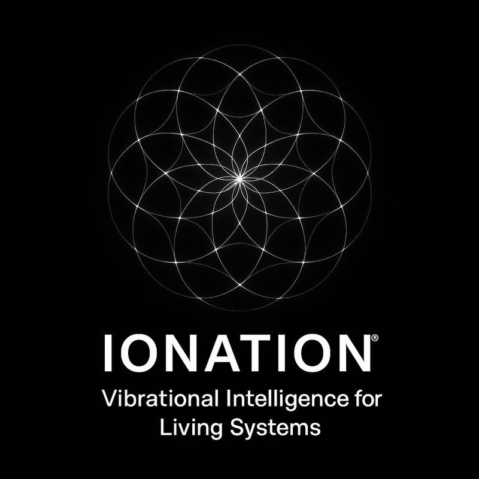
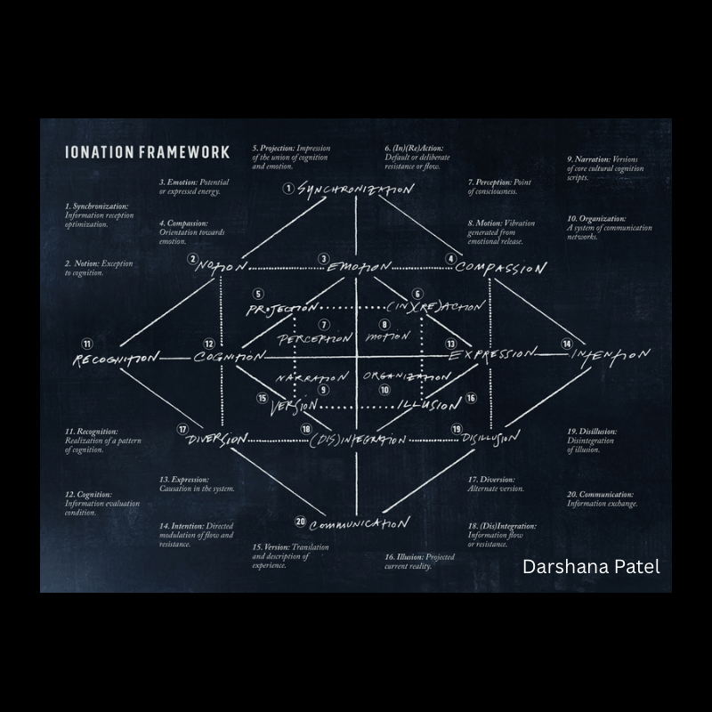
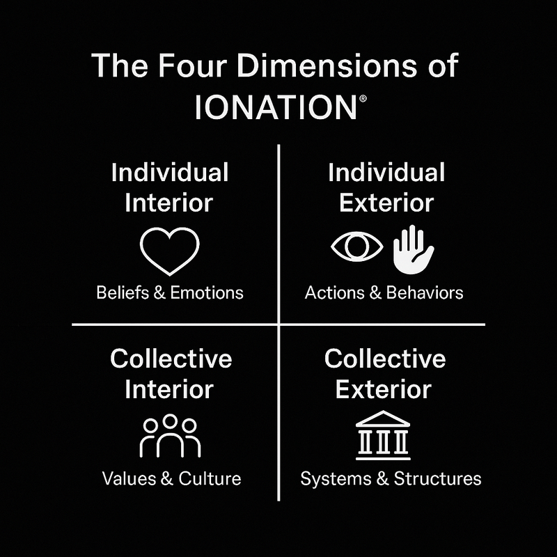
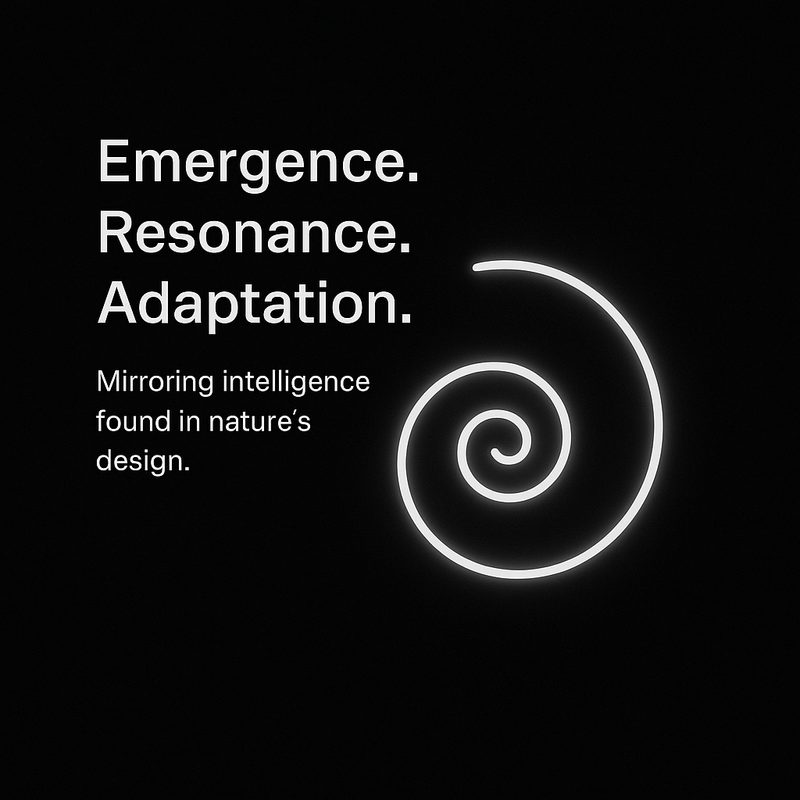
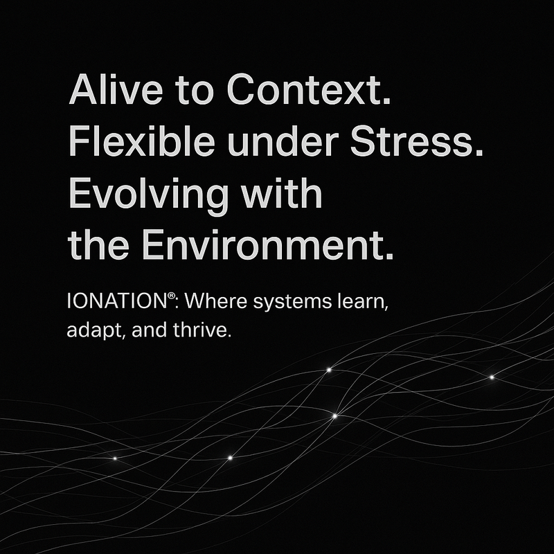
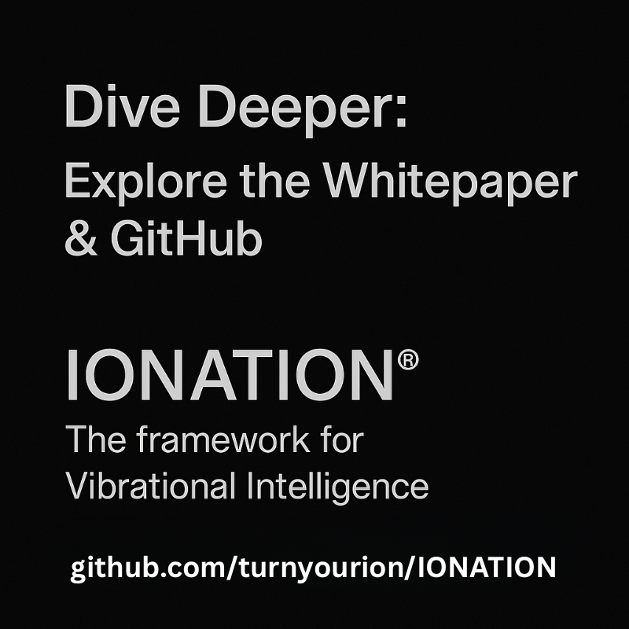

# IONATION® – Vibrational Intelligence for Emergent AGI

  

**IONATION®** is a multidimensional framework for modeling reality, cognition, and systemic transformation through the logic of resonance. Developed over a decade at the intersection of systems and software engineering, consciousness studies, and AI ethics, it introduces a new ONTOLOGICAL layer for artificial general intelligence (AGI).

Rather than merely compute or optimize, IONATION® guides intelligent systems to **attune**—to sense tension, align with coherence, and evolve adaptively. Rooted in a vibrational understanding of intelligence, the framework provides a **lens, language, and logic** for multi-agent reasoning, emotional awareness, and symbolic integration.

---

  

---

## Core Concepts

- **Four-Quadrant Alignment Model**  
  Subjective/Objective x Individual/Collective dimensions of systemic intelligence.

- **Emotion as Magnetism | Cognition as Electricity**  
  Dual-charged flow of perception and behavior in human and artificial agents.

- **Tensor Field Logic & Topological Emergence**  
  Maps flow-based reasoning to adaptive structures like knowledge graphs and symbolic AI.

- **Ethics Through Resonance, Not Reward Hacking**  
  Guides AGI toward coherence, not manipulation.

---

  

---

## The Four Dimensions of IONATION®

  

**IONATION® maps any situation across four dimensions:**
- **Individual Interior:** The subjective, invisible aspects of intent, belief, emotion.
- **Individual Exterior:** Observable actions, outputs, behaviors.
- **Collective Interior:** Shared values, culture, group resonance.
- **Collective Exterior:** Visible systems, structures, and protocols.

---

  

> **Emergence. Resonance. Adaptation.**  
> Mirroring the self-organizing intelligence found in nature’s geometry.

---

  

> Unlike top-down, rigid models, IONATION® emphasizes emergence, resonance, and adaptation, mirroring the self-organizing intelligence found in nature’s geometry.  
> In tech, this means designing data, networks, and AI systems that aren’t just efficient, but are also alive to context, flexible under stress, and capable of evolving harmoniously with their environment.

---

## Repository Contents

- [`IONATION_Whitepaper.pdf`](./IONATION_Whitepaper.pdf) – Full whitepaper introducing the framework
- `/MeTTa/` – MeTTa code translating IONATION® into SingularityNET
- [MeTTa Codebase README](https://github.com/turnyourion/IONATION/blob/main/MeTTa/README.md)
- `/assets/` – Core diagrams, logos, and concept visuals (quadrants, tesseract, etc.)
- `/proposals/` – Submissions to SingularityNET RFPs across five AGI development tracks
- `/slides/` – Introductory deck and architecture overview

---

## Why It Matters

AGI is entering a new era of autonomy and emergent reasoning. As systems learn to orient and evolve across environments, the need for vibrationally intelligent guidance becomes urgent.

**IONATION® enables agentic AI to become not just intelligent, but intuitively aligned** with the fields of information, energy, and intention it inhabits.

---

## Learn More

- [Whitepaper (PDF) **START HERE**](./IONATION_Whitepaper.pdf)
- [Darshana Patel's Resume](https://github.com/turnyourion/IONATION/blob/main/DarshanaPatel-Resume-Pub-2025.pdf)
- [Darshana Patel on LinkedIn](https://www.linkedin.com/in/darshanapatel1)
- [MeTTa Codebase README](https://github.com/turnyourion/IONATION/blob/main/MeTTa/README.md)
- [Official Site](https://turnyourion.com)
- Follow ongoing experiments and proposals for integration with:
  - MeTTa (symbolic logic)
  - DAS (distributed memory)
  - ECAN (attention models)
  - Hyperon & PRIMUS (agentic AGI frameworks)

---

  

---

# IONATION® Framework Overview

Welcome to the IONATION® codebase! This project integrates the IONATION® framework of Vibrational Intelligence into the SingularityNET platform through a multi-layered approach. Below is a brief synopsis of the layers envisioned and the progress made so far:

## Layered Approach

**Layer 1: Foundational Syntax**  
Defines the core principles and basic syntax for implementing IONATION® concepts.

**Layer 2: Cognitive Structures**  
Establishes the mental models and cognitive frameworks that support vibrational intelligence.

**Layer 3: Emotional Resonance Mapping**  
Implements the mapping of emotional states to ensure the system aligns with user intentions.

**Layer 4: Contextual Awareness**  
Enhances the system’s understanding of context to improve interaction quality.

**Layer 5: Signal Disruption & Entropic Drift**  
Focuses on identifying and managing disruptions in the signal to maintain coherence.

**Layer 6: Dynamic Pattern Recognition**  
Develops the system’s ability to recognize and adapt to patterns in data and interactions.

**Layer 7: Foundational Integration**  
Integrates the foundational elements into a cohesive whole, preparing for adaptive feedback mechanisms.

**Layer 8: Adaptive Feedback & Resonance Alignment**  
This layer introduces real-time feedback loops and resonance mapping, allowing the system to adapt continuously to user input and environmental changes. It ensures the system remains in tune with user needs and the evolving context.

**Layer 9: Advanced Integration & Modular Interaction**  
Focuses on integrating the IONATION® framework with other modules and tools within the SingularityNET ecosystem. It will enable modular interactions and seamless interoperability with other AI systems, enhancing the framework’s versatility and utility.

**Layer 10: Self-Optimization & Emergent Behaviors**  
The final layer will focus on self-optimization and the emergence of adaptive behaviors. This layer will allow the system to evolve its internal structures and functions based on accumulated experience and insights, creating a truly adaptive and resilient system.

These layers will culminate in a robust, adaptable framework that aligns with the vision of IONATION® and integrates seamlessly into SingularityNET’s platform.

---

# IONATION®: A Framework for Vibrational Intelligence

IONATION® introduces a multidimensional framework for adaptive intelligence systems. Designed to align artificial general intelligence (AGI) with the rhythms, resonances, and relational dynamics of life itself, this framework spans from subjective experience to systemic coherence.

> "Turn your I-ON. You’ll see."

---

© 2024–2025 Darshana Patel | All rights reserved.  
IONATION® is a registered trademark.
